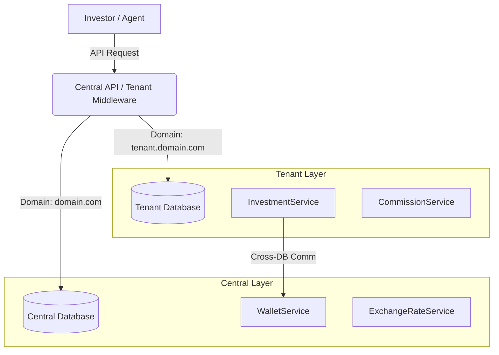

# Multi-Tenant P2P Crowdfunding Platform 🚀

This is a Senior-level implementation of a White-label Multi-tenant P2P Crowdfunding Platform, built with Laravel 11 and Node.js.

## High-Level Architecture



## Architectural Highlights
- **Strict Multi-Tenancy**: The application is split into two physical data domains:
  - **Central Database**: Holds `Users` (Investors/Agents), `Wallets`, `Currencies`, and `ExchangeRates`.
  - **Tenant Databases**: Holds `Projects`, `Investments`, `Commissions`, `Admins`, and `Issuers`.
- **Absolute Precision**: Financial columns use `BIGINT` (minor units) rather than `DECIMAL` to guarantee zero floating-point loss.
- **Pessimistic Locking**: Prevents concurrent request race conditions that could lead to wallet overdrafts using `DB::transaction()` and `lockForUpdate()`.
- **Immutable Audit Trails**: Wallet balances rely on an append-only `wallet_transactions` ledger with exact `balance_before` and `balance_after` snapshots.
- **Decoupled Microservice**: Exchange rates are fetched using a standalone Node.js scraper, honoring the separation of concerns.

*(For detailed architectural reasoning, please refer to [DECISIONS.md](DECISIONS.md) and [ERD.md](ERD.md)).*

## Assumptions
- Exchange rates are scraped at least once daily via the scheduler.
- Wallet balances are strictly stored in minor units (e.g., cents) based on the currency's decimal configuration.
- One investor has exactly one central wallet in their designated Home Currency.
- One Tenant operates strictly within one designated base currency.

## Known Limitations
- **Distributed Transactions**: Cross-database operations (between Central DB and Tenant DB) currently rely on compensation logic and application-level orchestration rather than true two-phase commit (2PC) atomicity. For massive production scale, a **Saga Pattern** or Event-Driven Architecture should be adopted to handle cross-DB rollbacks.

## Future Improvements
- **Message Broker (Kafka / RabbitMQ)**: Offload heavy cross-DB Commission distribution to an event bus.
- **Observability**: Implement Prometheus metrics & Grafana tracing to monitor investment lock periods and scraper latencies.
- **Redis Queues**: Transition `UnlockInvestmentsJob` to a distributed queue system for faster parallel execution of daily maturities.

## Setup Instructions

### 1. Prerequisites
- PHP 8.3+
- Node.js 18+
- PostgreSQL or MySQL (PostgreSQL recommended for robust locking mechanisms)
- Composer & NPM

### 2. Environment Setup
1. Copy `.env.example` to `.env`.
2. Configure your Central DB in `.env`.
3. Set your internal secret: `SYSTEM_API_KEY=your-secure-secret`.

### 3. Database Migrations
Because of the multi-tenant architecture, migrations are split:
```bash
# 1. Migrate the Central Database
php artisan migrate

# 2. Migrate the Tenant Databases
php artisan migrate --path=database/migrations/tenant --database=tenant
```

### 4. Running the Exchange Rate Scraper
```bash
cd scraper
npm install
cd ..
php artisan scraper:run
```

### 5. Running the Test Suite
The business-critical logic (Service Layer) is heavily tested using PHPUnit.
```bash
php artisan test
```
